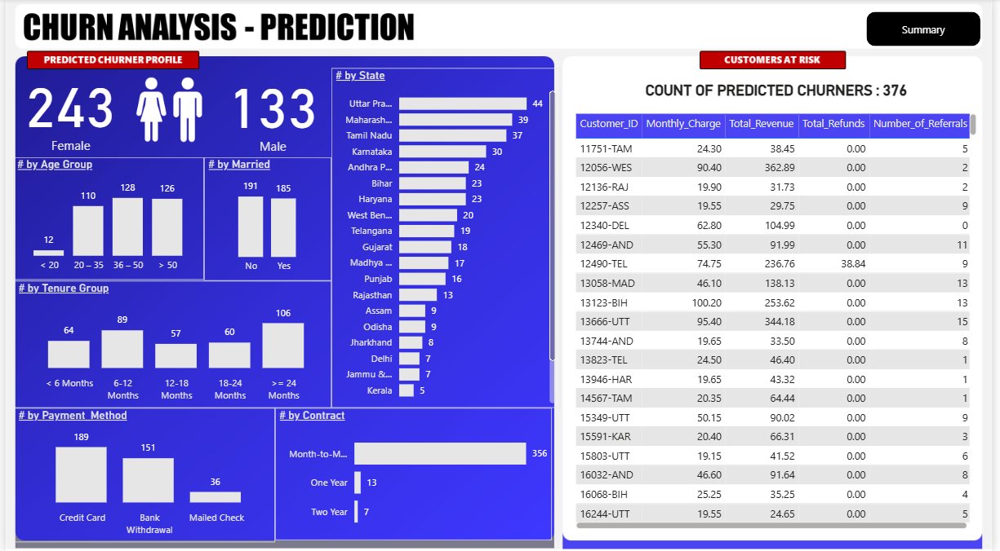

# 📊 Customer Churn Analysis & Prediction (End-to-End)

## 📌 Project Overview
This project delivers an **end-to-end customer churn analytics solution**, covering the complete lifecycle from **data ingestion and transformation (SQL)** to **business intelligence dashboards (Power BI)** and **machine learning–based churn prediction (Python – Random Forest)**.

The objective is to help businesses **understand churn drivers**, **identify high-risk customer segments**, and **proactively target future churners** using data-driven insights.

---

## 🎯 Business Objectives
- Analyze customer churn across:
  - **Demographics**
  - **Geography**
  - **Account & payment information**
  - **Service usage**
- Identify churn patterns and high-risk customer profiles
- Enable **targeted marketing and retention strategies**
- Predict **future churners** using machine learning

---

## 🛠️ Tech Stack
- **SQL Server** – ETL, data cleaning, production tables, analytical views  
- **Power BI** – Data modeling, DAX measures, interactive dashboards  
- **Python** – Random Forest churn prediction model  
- **Libraries** – Pandas, NumPy, Scikit-learn, Seaborn, Matplotlib  

---

## 🔄 ETL Pipeline (SQL Server)
1. Raw customer data ingested into a **staging table**
2. Data profiling and null analysis
3. Data cleansing and standardization using `ISNULL`
4. Creation of **production-ready churn table**
5. Analytical views created for:
   - Power BI reporting
   - Machine learning data preparation

---

## 📊 Power BI Dashboard

### 🔹 Churn Summary Dashboard

**Key KPIs:**
- Total Customers  
- New Joiners  
- Total Churn  
- Churn Rate (%)  

**Insights Provided:**
- Churn by gender, age group, contract type, payment method
- Geographic churn hotspots
- Service-level churn patterns

---

### 🔹 Churn Prediction Dashboard

**Purpose:**
- Visualize customers **predicted to churn**
- Enable actionable decision-making for retention teams

---

## 🤖 Machine Learning – Churn Prediction
- **Algorithm:** Random Forest Classifier
- **Target Variable:** Customer Churn (Stayed vs Churned)
- **Key Steps:**
  - Feature encoding & preprocessing
  - Train–test split
  - Model evaluation (confusion matrix, classification report)
  - Feature importance analysis
  - Prediction on newly joined customers

📂 Notebook available in:
ml/churn_prediction_random_forest.ipynb

---

## 📈 Key Insights
- Customers on **month-to-month contracts** show the highest churn
- **Electronic check** payment method customers churn more frequently
- **Low-tenure customers** are significantly more likely to churn
- Certain service combinations increase churn probability

---

## 💼 Business Impact
This solution enables organizations to:
- Identify high-risk churn segments early
- Launch targeted retention campaigns
- Reduce revenue loss through proactive customer engagement
- Combine **BI insights + predictive analytics** for decision-making

---

## 🚀 Future Enhancements
- Deploy churn model as an API
- Automate data refresh pipelines
- Add explainability (SHAP values)
- Integrate predictions directly into Power BI via SQL

---

## 👤 Author
**Prkriti Puri**  
Data Analyst | BI Analyst | Analytics  

🔗 LinkedIn: https://www.linkedin.com/in/prkriti-puri/  
🔗 GitHub: https://github.com/Prkriti079  
